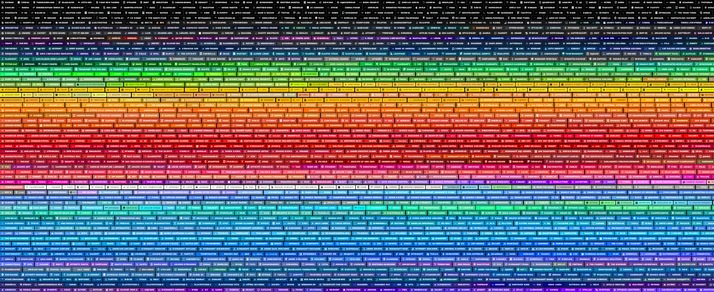

# Generate and Sort Branded [Shields.io](https://shields.io) Badges by Color

**This is a Python 3 command-line tool and [GitHub Action](https://github.com/features/actions) automating the generation and color sorting of badges from [Shields.io](https://shields.io) that contain logos from [Simple Icons](https://simpleicons.org/).**

## Background:

Many [awesome GitHub profiles](https://github.com/abhisheknaiidu/awesome-github-profile-readme) contain a series of these badges to clearly indicate which tools, services, or other brands the user is affiliated with. These badge collections usually adopt the brand's color, icon, and name.

## The problem:

[Shields.io](https://shields.io) URLs for these badges are normally handcrafted or copypasta, following this rough format:

`https://img.shields.io/badge/<URL_ENCODED_BRAND_NAME>-<BRAND_HEX_COLOR>.svg?style=<BADGE_STYLE>&logoColor=<TEXT_HEX_COLOR>&logo=<SIMPLE_ICONS_SLUG>`

Normally, the user must repeat the process of manually rendering this URL for each badge they wish to display. This is what the result of this work might look like:


Then, if the user is inclined, they may spend additional time ordering the badges by color to make their profile more visually appealing:



This is a time consuming process if performed manually; it is difficult to maintain, hard to keep consistent, and makes future adjustments offputting.

## The solution:

This project automates the process of rendering out the badges into Markdown or HTML from a simple list of slugs.

The badges can be sorted by color _[as default]_ or left in the order specified.


> **Note**
> _Thanks to [this article](https://www.alanzucconi.com/2015/09/30/colour-sorting/) by **Alan Zucconi**, the visually appealing color sort is achived using a Hilbert walk._

## Examples:

### Generate five specific badges ordered by color:

#### _GitHub Action:_

```yaml
      - uses: docker://ghcr.io/chipwolf/generate-badges:latest
        with:
          format: markdown # default
          id: default # default
          output: README.md
          slugs: |
            osu
            github
            americanexpress
            nodered
            opensea
          sort: 'hilbert' # default
          style: 'for-the-badge' # default
```

#### _CLI:_

```bash
$ python3 icons.py -s osu github americanexpress nodered opensea
```

#### _Output:_

<!-- start chipwolf/generate-badges default -->
[](https://github.com/ChipWolf/generate-badges)


<!-- end chipwolf/generate-badges default -->

---

### Generate five random badges:

#### _GitHub Action:_

```yaml
      - uses: docker://ghcr.io/chipwolf/generate-badges:latest
        with:
          id: foobar
          format: html
          output: README.md
          random: 5
          sort: 'false'
          style: flat-square
```

#### _CLI:_

```bash
$ python3 icons.py -i foobar -s false -r 5 -f html -b flat-square
```

#### _Output:_

<!-- start chipwolf/generate-badges foobar -->
<p>
  <a href="#"></a>
  <a href="#"></a>
  <a href="#"></a>
  <a href="#"></a>
  <a href="#"></a>
  <a href="https://github.com/ChipWolf/generate-badges"></a>
</p>
<!-- end chipwolf/generate-badges foobar -->

---

### Generate badges from a list of slugs, sorting using an inverted algorithm:

#### _GitHub Action:_

```yaml
      - uses: docker://ghcr.io/chipwolf/generate-badges:latest
        with:
          args: '--hue-rotate 240'
          id: example
          format: html
          output: README.md
          sort: 'step_invert'
          style: flat
          slugs: |
            angular,apollographql,brave,d3dotjs,docker
            git,githubactions,googlecloud,graphql,heroku
            html5,insomnia,mongodb,nestjs,nodedotjs
            npm,prettier,react,reactivex,redux
            rollupdotjs,sass,styledcomponents,typescript,webpack
```

#### _CLI:_

```bash
$ python3 icons.py -i example -c step_invert -o README.md -f html -b flat-square --hue-rotate 240 -s \
    angular,apollographql,brave,d3dotjs,docker, \
    git,githubactions,googlecloud,graphql,heroku, \
    html5,insomnia,mongodb,nestjs,nodedotjs, \
    npm,prettier,react,reactivex,redux, \
    rollupdotjs,sass,styledcomponents,typescript,webpack
```

#### _Output:_

<!-- start chipwolf/generate-badges example -->
<p>
  <a href="#"></a>
  <a href="#"></a>
  <a href="#"></a>
  <a href="#"></a>
  <a href="#"></a>
  <a href="#"></a>
  <a href="#"></a>
  <a href="#"></a>
  <a href="#"></a>
  <a href="#"></a>
  <a href="#"></a>
  <a href="#"></a>
  <a href="#"></a>
  <a href="#"></a>
  <a href="#"></a>
  <a href="#"></a>
  <a href="#"></a>
  <a href="#"></a>
  <a href="#"></a>
  <a href="#"></a>
  <a href="#"></a>
  <a href="#"></a>
  <a href="#"></a>
  <a href="#"></a>
  <a href="#"></a>
  <a href="https://github.com/ChipWolf/generate-badges"></a>
</p>
<!-- end chipwolf/generate-badges example -->
