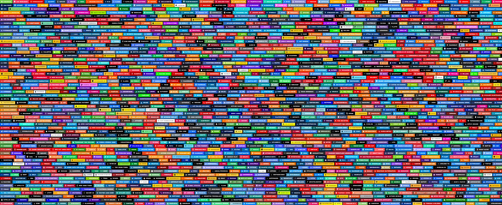
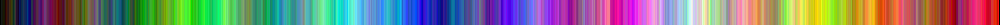

[](https://github.com/ChipWolf/BadgeSort)

# Generate and Sort Branded [Shields.io](https://shields.io) and [Badgen.net](https://badgen.net) Badges by Color

**This is a Python 3 command-line tool and [GitHub Action](https://github.com/features/actions) automating the generation and color sorting of badges from [Shields.io](https://shields.io) and [Badgen.net](https://badgen.net) that contain brand logos from [Simple Icons](https://simpleicons.org/).**

## 🎨 Interactive Generator

**New!** Try the [interactive web-based generator](https://chipwolf.github.io/BadgeSort/) to visually configure and generate your BadgeSort YAML! No installation required - just select your badges, configure the options, and copy the generated GitHub Actions YAML.

## Background:

Many [awesome GitHub profiles](https://github.com/abhisheknaiidu/awesome-github-profile-readme) contain a series of these badges to clearly indicate which tools, services, or other brands the user is affiliated with. These badge collections usually adopt the brand's color, icon, and name.

## The problem:

Badge services like [Shields.io](https://shields.io) and [Badgen.net](https://badgen.net) provide URLs for these badges that are normally handcrafted or copypasta.

For Shields.io, the format is:
`https://img.shields.io/badge/<URL_ENCODED_BRAND_NAME>-<BRAND_HEX_COLOR>.svg?style=<BADGE_STYLE>&logoColor=<TEXT_HEX_COLOR>&logo=<SIMPLE_ICONS_SLUG>`

For Badgen.net, custom icons require base64-encoded SVG data:
`https://badgen.net/badge/icon/<BRAND_NAME>?icon=<BASE64_ENCODED_SVG>&label&color=<BRAND_HEX_COLOR>`

Normally, the user must repeat the process of manually rendering this URL for each badge they wish to display. This is what the result of this work might look like:



Then, if the user is inclined, they may spend additional time ordering the badges by color to make their profile more visually appealing:


This is a time consuming process if performed manually; it is difficult to maintain, hard to keep consistent, and makes future adjustments offputting.

## The solution:

This project automates the process of rendering out the badges into Markdown or HTML from a simple list of slugs.

The badges can be sorted by color _[as default]_ or left in the order specified.



> **Note**
> _Thanks to [this article](https://www.alanzucconi.com/2015/09/30/colour-sorting/) by **Alan Zucconi**, the visually appealing color sort is achived using a Hilbert walk._

## Setup Requirements:

### Comment Markers for Badge Interpolation

When using BadgeSort to update a file (like `README.md`), you **must** include special HTML comment markers in your target file. These markers tell BadgeSort where to insert or update the badges.

#### Required Syntax:

```html
<!-- start chipwolf/badgesort {id} -->
<!-- end chipwolf/badgesort {id} -->
```

- **`{id}`**: A unique identifier that matches the `id` parameter in your GitHub Action or CLI command
- BadgeSort will replace **everything between** these markers with the generated badges
- The markers themselves are preserved and remain in your file

#### Default ID:

If you don't specify an `id`, the default value is `default`:

```html
<!-- start chipwolf/badgesort default -->
[](https://github.com/ChipWolf/BadgeSort)


<!-- end chipwolf/badgesort default -->
```

#### Multiple Badge Sections:

You can have multiple badge sections in the same file by using different IDs:

```html
<!-- start chipwolf/badgesort section1 -->
<!-- end chipwolf/badgesort section1 -->

Some other content...

<!-- start chipwolf/badgesort section2 -->
<!-- end chipwolf/badgesort section2 -->
```

> **Important**
> Without these comment markers in your target file, BadgeSort will only output badges to stdout (or the console) rather than updating the file.

## Customizing Individual Badges:

BadgeSort allows you to customize individual badges using URL query string syntax. You can override the color, text, and hyperlink URL for any badge.

### Syntax:

```
slug?param=value&param2=value2
```

### Supported Parameters:

- **`color`**: Override the badge background color (hex color without `#`)
- **`text`**: Override the badge label text (use empty value `text=` to remove text)
- **`url`**: Add a custom hyperlink URL (for Markdown/HTML output)

### Examples:

#### _GitHub Action:_

```yaml
      - uses: docker://ghcr.io/chipwolf/badgesort:latest
        with:
          format: markdown
          id: custom
          output: README.md
          slugs: |
            osu?color=000000
            github?text=ChipWolf&url=https://github.com/ChipWolf
            nodered?text=
            opensea
          sort: hilbert
          style: for-the-badge
```

#### _CLI:_

```bash
$ python -m badgesort.icons -s \
    "osu?color=000000" \
    "github?text=ChipWolf&url=https://github.com/ChipWolf" \
    "nodered?text=" \
    opensea \
    -o README.md
```

#### _Required comment markers in README.md:_

```html
<!-- start chipwolf/badgesort custom -->

[](https://github.com/ChipWolf/BadgeSort)
[](https://github.com/ChipWolf)


<!-- end chipwolf/badgesort custom -->
```

> **Note**: The `id` value `custom` in the comment markers matches the `id` parameter in the GitHub Action (or the `-i` parameter in CLI).

#### _Output:_

<!-- start chipwolf/badgesort custom -->

[](https://github.com/ChipWolf/BadgeSort)
[](https://github.com/ChipWolf)


<!-- end chipwolf/badgesort custom -->

> **Note**
> Parameters are parsed using Python's standard `urllib.parse` library, following standard URL query string conventions.

## Examples:

### Generate five specific badges ordered by color:

#### _GitHub Action:_

```yaml
      - uses: docker://ghcr.io/chipwolf/badgesort:latest
        with:
          format: markdown # default
          id: default # default
          output: README.md
          slugs: |
            osu
            github
            americanexpress
            nodered
            opensea
          sort: hilbert # default
          style: for-the-badge # default
```

#### _CLI:_

```bash
$ python -m badgesort.icons -s osu github americanexpress nodered opensea -o README.md
```

#### _Required comment markers in README.md:_

```html
<!-- start chipwolf/badgesort default -->
[](https://github.com/ChipWolf/BadgeSort)


<!-- end chipwolf/badgesort default -->
```

> **Note**: The `id` value `default` in the comment markers matches the `id` parameter in the GitHub Action (or the default when not specified in CLI).

#### _Output:_

<!-- start chipwolf/badgesort default -->
[](https://github.com/ChipWolf/BadgeSort)


<!-- end chipwolf/badgesort default -->

---

### Generate five random badges:

#### _GitHub Action:_

```yaml
      - uses: docker://ghcr.io/chipwolf/badgesort:latest
        with:
          id: foobar
          format: html
          output: README.md
          random: 5
          sort: false
          style: flat-square
```

#### _CLI:_

```bash
$ python -m badgesort.icons -i foobar -c false -r 5 -f html -b flat-square -o README.md
```

#### _Required comment markers in README.md:_

```html
<!-- start chipwolf/badgesort foobar -->
<p>
  <a href="#"></a>
  <a href="#"></a>
  <a href="#"></a>
  <a href="#"></a>
  <a href="#"></a>
  <a href="https://github.com/ChipWolf/BadgeSort"></a>
</p>
<!-- end chipwolf/badgesort foobar -->
```

> **Note**: The custom `id` value `foobar` must match in both the GitHub Action input (or CLI `-i` parameter) and the comment markers.

#### _Output:_

<!-- start chipwolf/badgesort foobar -->
<p>
  <a href="#"></a>
  <a href="#"></a>
  <a href="#"></a>
  <a href="#"></a>
  <a href="#"></a>
  <a href="https://github.com/ChipWolf/BadgeSort"></a>
</p>
<!-- end chipwolf/badgesort foobar -->

---

### Generate badges from a list of slugs, sorting using an inverted step algorithm:

#### _GitHub Action:_

```yaml
      - uses: docker://ghcr.io/chipwolf/badgesort:latest
        with:
          args: |
            --hue-rotate 240
          id: example
          format: html
          output: README.md
          sort: step_invert
          style: flat
          slugs: |
            angular,apollographql,brave,d3dotjs,docker
            git,githubactions,googlecloud,graphql,heroku
            html5,insomnia,mongodb,nestjs,nodedotjs
            npm,prettier,react,reactivex,redux
            rollupdotjs,sass,styledcomponents,typescript,webpack
```

#### _CLI:_

```bash
$ python -m badgesort.icons -i example -c step_invert -o README.md -f html -b flat --hue-rotate 240 -s \
    angular,apollographql,brave,d3dotjs,docker, \
    git,githubactions,googlecloud,graphql,heroku, \
    html5,insomnia,mongodb,nestjs,nodedotjs, \
    npm,prettier,react,reactivex,redux, \
    rollupdotjs,sass,styledcomponents,typescript,webpack
```

#### _Required comment markers in README.md:_

```html
<!-- start chipwolf/badgesort example -->
<p>
  <a href="#"></a>
  <a href="#"></a>
  <a href="#"></a>
  <a href="#"></a>
  <a href="#"></a>
  <a href="#"></a>
  <a href="#"></a>
  <a href="#"></a>
  <a href="#"></a>
  <a href="#"></a>
  <a href="#"></a>
  <a href="#"></a>
  <a href="#"></a>
  <a href="#"></a>
  <a href="#"></a>
  <a href="#"></a>
  <a href="#"></a>
  <a href="#"></a>
  <a href="#"></a>
  <a href="#"></a>
  <a href="#"></a>
  <a href="#"></a>
  <a href="#"></a>
  <a href="#"></a>
  <a href="#"></a>
  <a href="https://github.com/ChipWolf/BadgeSort"></a>
</p>
<!-- end chipwolf/badgesort example -->
```

#### _Output:_

<!-- start chipwolf/badgesort example -->
<p>
  <a href="#"></a>
  <a href="#"></a>
  <a href="#"></a>
  <a href="#"></a>
  <a href="#"></a>
  <a href="#"></a>
  <a href="#"></a>
  <a href="#"></a>
  <a href="#"></a>
  <a href="#"></a>
  <a href="#"></a>
  <a href="#"></a>
  <a href="#"></a>
  <a href="#"></a>
  <a href="#"></a>
  <a href="#"></a>
  <a href="#"></a>
  <a href="#"></a>
  <a href="#"></a>
  <a href="#"></a>
  <a href="#"></a>
  <a href="#"></a>
  <a href="#"></a>
  <a href="#"></a>
  <a href="#"></a>
  <a href="https://github.com/ChipWolf/BadgeSort"></a>
</p>
<!-- end chipwolf/badgesort example -->

---

### Generate badges with Badgen.net:

#### _GitHub Action:_

```yaml
      - uses: docker://ghcr.io/chipwolf/badgesort:latest
        with:
          id: badgen-example
          format: markdown
          output: README.md
          provider: badgen
          slugs: |
            github
            python
            docker
            oxygen
          sort: hilbert
```

#### _CLI:_

```bash
$ python -m badgesort.icons -p badgen -s github python docker oxygen
```

> **Note on Badgen Icon Visibility**
> 
> Unlike Shields.io, Badgen.net doesn't support black text on badges, only white text on colored backgrounds. To ensure icon visibility on bright brand colors, BadgeSort automatically adjusts very bright icons:
> - **Bright icons** (brightness > 0.7): Scaled down to brightness of 0.7 for optimal visibility
> 
> This preserves the icon's hue and saturation while ensuring it remains visible against bright brand color backgrounds.

#### _Output:_

<!-- start chipwolf/badgesort badgen-example -->
[](https://github.com/ChipWolf/BadgeSort)
![GitHub](https://badgen.net/badge/icon/GitHub?icon=data%3Aimage%2Fsvg%2Bxml%3Bbase64%2CPHN2ZyByb2xlPSJpbWciIHZpZXdCb3g9IjAgMCAyNCAyNCIgeG1sbnM9Imh0dHA6Ly93d3cudzMub3JnLzIwMDAvc3ZnIj48dGl0bGU%2BR2l0SHViPC90aXRsZT48cGF0aCBmaWxsPSJ3aGl0ZSIgZD0iTTEyIC4yOTdjLTYuNjMgMC0xMiA1LjM3My0xMiAxMiAwIDUuMzAzIDMuNDM4IDkuOCA4LjIwNSAxMS4zODUuNi4xMTMuODItLjI1OC44Mi0uNTc3IDAtLjI4NS0uMDEtMS4wNC0uMDE1LTIuMDQtMy4zMzguNzI0LTQuMDQyLTEuNjEtNC4wNDItMS42MUM0LjQyMiAxOC4wNyAzLjYzMyAxNy43IDMuNjMzIDE3LjdjLTEuMDg3LS43NDQuMDg0LS43MjkuMDg0LS43MjkgMS4yMDUuMDg0IDEuODM4IDEuMjM2IDEuODM4IDEuMjM2IDEuMDcgMS44MzUgMi44MDkgMS4zMDUgMy40OTUuOTk4LjEwOC0uNzc2LjQxNy0xLjMwNS43Ni0xLjYwNS0yLjY2NS0uMy01LjQ2Ni0xLjMzMi01LjQ2Ni01LjkzIDAtMS4zMS40NjUtMi4zOCAxLjIzNS0zLjIyLS4xMzUtLjMwMy0uNTQtMS41MjMuMTA1LTMuMTc2IDAgMCAxLjAwNS0uMzIyIDMuMyAxLjIzLjk2LS4yNjcgMS45OC0uMzk5IDMtLjQwNSAxLjAyLjAwNiAyLjA0LjEzOCAzIC40MDUgMi4yOC0xLjU1MiAzLjI4NS0xLjIzIDMuMjg1LTEuMjMuNjQ1IDEuNjUzLjI0IDIuODczLjEyIDMuMTc2Ljc2NS44NCAxLjIzIDEuOTEgMS4yMyAzLjIyIDAgNC42MS0yLjgwNSA1LjYyNS01LjQ3NSA1LjkyLjQyLjM2LjgxIDEuMDk2LjgxIDIuMjIgMCAxLjYwNi0uMDE1IDIuODk2LS4wMTUgMy4yODYgMCAuMzE1LjIxLjY5LjgyNS41N0MyMC41NjUgMjIuMDkyIDI0IDE3LjU5MiAyNCAxMi4yOTdjMC02LjYyNy01LjM3My0xMi0xMi0xMiIvPjwvc3ZnPg%3D%3D&label&color=181717&labelColor=181717)
![Docker](https://badgen.net/badge/icon/Docker?icon=data%3Aimage%2Fsvg%2Bxml%3Bbase64%2CPHN2ZyByb2xlPSJpbWciIHZpZXdCb3g9IjAgMCAyNCAyNCIgeG1sbnM9Imh0dHA6Ly93d3cudzMub3JnLzIwMDAvc3ZnIj48dGl0bGU%2BRG9ja2VyPC90aXRsZT48cGF0aCBmaWxsPSJ3aGl0ZSIgZD0iTTEzLjk4MyAxMS4wNzhoMi4xMTlhLjE4Ni4xODYgMCAwMC4xODYtLjE4NVY5LjAwNmEuMTg2LjE4NiAwIDAwLS4xODYtLjE4NmgtMi4xMTlhLjE4NS4xODUgMCAwMC0uMTg1LjE4NXYxLjg4OGMwIC4xMDIuMDgzLjE4NS4xODUuMTg1bS0yLjk1NC01LjQzaDIuMTE4YS4xODYuMTg2IDAgMDAuMTg2LS4xODZWMy41NzRhLjE4Ni4xODYgMCAwMC0uMTg2LS4xODVoLTIuMTE4YS4xODUuMTg1IDAgMDAtLjE4NS4xODV2MS44ODhjMCAuMTAyLjA4Mi4xODUuMTg1LjE4NW0wIDIuNzE2aDIuMTE4YS4xODcuMTg3IDAgMDAuMTg2LS4xODZWNi4yOWEuMTg2LjE4NiAwIDAwLS4xODYtLjE4NWgtMi4xMThhLjE4NS4xODUgMCAwMC0uMTg1LjE4NXYxLjg4N2MwIC4xMDIuMDgyLjE4NS4xODUuMTg2bS0yLjkzIDBoMi4xMmEuMTg2LjE4NiAwIDAwLjE4NC0uMTg2VjYuMjlhLjE4NS4xODUgMCAwMC0uMTg1LS4xODVIOC4xYS4xODUuMTg1IDAgMDAtLjE4NS4xODV2MS44ODdjMCAuMTAyLjA4My4xODUuMTg1LjE4Nm0tMi45NjQgMGgyLjExOWEuMTg2LjE4NiAwIDAwLjE4NS0uMTg2VjYuMjlhLjE4NS4xODUgMCAwMC0uMTg1LS4xODVINS4xMzZhLjE4Ni4xODYgMCAwMC0uMTg2LjE4NXYxLjg4N2MwIC4xMDIuMDg0LjE4NS4xODYuMTg2bTUuODkzIDIuNzE1aDIuMTE4YS4xODYuMTg2IDAgMDAuMTg2LS4xODVWOS4wMDZhLjE4Ni4xODYgMCAwMC0uMTg2LS4xODZoLTIuMTE4YS4xODUuMTg1IDAgMDAtLjE4NS4xODV2MS44ODhjMCAuMTAyLjA4Mi4xODUuMTg1LjE4NW0tMi45MyAwaDIuMTJhLjE4NS4xODUgMCAwMC4xODQtLjE4NVY5LjAwNmEuMTg1LjE4NSAwIDAwLS4xODQtLjE4NmgtMi4xMmEuMTg1LjE4NSAwIDAwLS4xODQuMTg1djEuODg4YzAgLjEwMi4wODMuMTg1LjE4NS4xODVtLTIuOTY0IDBoMi4xMTlhLjE4NS4xODUgMCAwMC4xODUtLjE4NVY5LjAwNmEuMTg1LjE4NSAwIDAwLS4xODQtLjE4NmgtMi4xMmEuMTg2LjE4NiAwIDAwLS4xODYuMTg2djEuODg3YzAgLjEwMi4wODQuMTg1LjE4Ni4xODVtLTIuOTIgMGgyLjEyYS4xODUuMTg1IDAgMDAuMTg0LS4xODVWOS4wMDZhLjE4NS4xODUgMCAwMC0uMTg0LS4xODZoLTIuMTJhLjE4NS4xODUgMCAwMC0uMTg0LjE4NXYxLjg4OGMwIC4xMDIuMDgyLjE4NS4xODUuMTg1TTIzLjc2MyA5Ljg5Yy0uMDY1LS4wNTEtLjY3Mi0uNTEtMS45NTQtLjUxLS4zMzguMDAxLS42NzYuMDMtMS4wMS4wODctLjI0OC0xLjctMS42NTMtMi41My0xLjcxNi0yLjU2NmwtLjM0NC0uMTk5LS4yMjYuMzI3Yy0uMjg0LjQzOC0uNDkuOTIyLS42MTIgMS40My0uMjMuOTctLjA5IDEuODgyLjQwMyAyLjY2MS0uNTk1LjMzMi0xLjU1LjQxMy0xLjc0NC40MkguNzUxYS43NTEuNzUxIDAgMDAtLjc1Ljc0OCAxMS4zNzYgMTEuMzc2IDAgMDAuNjkyIDQuMDYyYy41NDUgMS40MjggMS4zNTUgMi40OCAyLjQxIDMuMTI0IDEuMTguNzIzIDMuMSAxLjEzNyA1LjI3NSAxLjEzNy45ODMuMDAzIDEuOTYzLS4wODYgMi45My0uMjY2YTEyLjI0OCAxMi4yNDggMCAwMDMuODIzLTEuMzg5Yy45OC0uNTY3IDEuODYtMS4yODggMi42MS0yLjEzNiAxLjI1Mi0xLjQxOCAxLjk5OC0yLjk5NyAyLjU1My00LjRoLjIyMWMxLjM3MiAwIDIuMjE1LS41NDkgMi42OC0xLjAwOS4zMDktLjI5My41NS0uNjUuNzA3LTEuMDQ2bC4wOTgtLjI4OFoiLz48L3N2Zz4%3D&label&color=2496ED&labelColor=2496ED)
![Python](https://badgen.net/badge/icon/Python?icon=data%3Aimage%2Fsvg%2Bxml%3Bbase64%2CPHN2ZyByb2xlPSJpbWciIHZpZXdCb3g9IjAgMCAyNCAyNCIgeG1sbnM9Imh0dHA6Ly93d3cudzMub3JnLzIwMDAvc3ZnIj48dGl0bGU%2BUHl0aG9uPC90aXRsZT48cGF0aCBmaWxsPSJ3aGl0ZSIgZD0iTTE0LjI1LjE4bC45LjIuNzMuMjYuNTkuMy40NS4zMi4zNC4zNC4yNS4zNC4xNi4zMy4xLjMuMDQuMjYuMDIuMi0uMDEuMTNWOC41bC0uMDUuNjMtLjEzLjU1LS4yMS40Ni0uMjYuMzgtLjMuMzEtLjMzLjI1LS4zNS4xOS0uMzUuMTQtLjMzLjEtLjMuMDctLjI2LjA0LS4yMS4wMkg4Ljc3bC0uNjkuMDUtLjU5LjE0LS41LjIyLS40MS4yNy0uMzMuMzItLjI3LjM1LS4yLjM2LS4xNS4zNy0uMS4zNS0uMDcuMzItLjA0LjI3LS4wMi4yMXYzLjA2SDMuMTdsLS4yMS0uMDMtLjI4LS4wNy0uMzItLjEyLS4zNS0uMTgtLjM2LS4yNi0uMzYtLjM2LS4zNS0uNDYtLjMyLS41OS0uMjgtLjczLS4yMS0uODgtLjE0LTEuMDUtLjA1LTEuMjMuMDYtMS4yMi4xNi0xLjA0LjI0LS44Ny4zMi0uNzEuMzYtLjU3LjQtLjQ0LjQyLS4zMy40Mi0uMjQuNC0uMTYuMzYtLjEuMzItLjA1LjI0LS4wMWguMTZsLjA2LjAxaDguMTZ2LS44M0g2LjE4bC0uMDEtMi43NS0uMDItLjM3LjA1LS4zNC4xMS0uMzEuMTctLjI4LjI1LS4yNi4zMS0uMjMuMzgtLjIuNDQtLjE4LjUxLS4xNS41OC0uMTIuNjQtLjEuNzEtLjA2Ljc3LS4wNC44NC0uMDIgMS4yNy4wNXptLTYuMyAxLjk4bC0uMjMuMzMtLjA4LjQxLjA4LjQxLjIzLjM0LjMzLjIyLjQxLjA5LjQxLS4wOS4zMy0uMjIuMjMtLjM0LjA4LS40MS0uMDgtLjQxLS4yMy0uMzMtLjMzLS4yMi0uNDEtLjA5LS40MS4wOXptMTMuMDkgMy45NWwuMjguMDYuMzIuMTIuMzUuMTguMzYuMjcuMzYuMzUuMzUuNDcuMzIuNTkuMjguNzMuMjEuODguMTQgMS4wNC4wNSAxLjIzLS4wNiAxLjIzLS4xNiAxLjA0LS4yNC44Ni0uMzIuNzEtLjM2LjU3LS40LjQ1LS40Mi4zMy0uNDIuMjQtLjQuMTYtLjM2LjA5LS4zMi4wNS0uMjQuMDItLjE2LS4wMWgtOC4yMnYuODJoNS44NGwuMDEgMi43Ni4wMi4zNi0uMDUuMzQtLjExLjMxLS4xNy4yOS0uMjUuMjUtLjMxLjI0LS4zOC4yLS40NC4xNy0uNTEuMTUtLjU4LjEzLS42NC4wOS0uNzEuMDctLjc3LjA0LS44NC4wMS0xLjI3LS4wNC0xLjA3LS4xNC0uOS0uMi0uNzMtLjI1LS41OS0uMy0uNDUtLjMzLS4zNC0uMzQtLjI1LS4zNC0uMTYtLjMzLS4xLS4zLS4wNC0uMjUtLjAyLS4yLjAxLS4xM3YtNS4zNGwuMDUtLjY0LjEzLS41NC4yMS0uNDYuMjYtLjM4LjMtLjMyLjMzLS4yNC4zNS0uMi4zNS0uMTQuMzMtLjEuMy0uMDYuMjYtLjA0LjIxLS4wMi4xMy0uMDFoNS44NGwuNjktLjA1LjU5LS4xNC41LS4yMS40MS0uMjguMzMtLjMyLjI3LS4zNS4yLS4zNi4xNS0uMzYuMS0uMzUuMDctLjMyLjA0LS4yOC4wMi0uMjFWNi4wN2gyLjA5bC4xNC4wMXptLTYuNDcgMTQuMjVsLS4yMy4zMy0uMDguNDEuMDguNDEuMjMuMzMuMzMuMjMuNDEuMDguNDEtLjA4LjMzLS4yMy4yMy0uMzMuMDgtLjQxLS4wOC0uNDEtLjIzLS4zMy0uMzMtLjIzLS40MS0uMDgtLjQxLjA4eiIvPjwvc3ZnPg%3D%3D&label&color=3776AB&labelColor=3776AB)
![Oxygen](https://badgen.net/badge/icon/Oxygen?icon=data%3Aimage%2Fsvg%2Bxml%3Bbase64%2CPHN2ZyByb2xlPSJpbWciIHZpZXdCb3g9IjAgMCAyNCAyNCIgeG1sbnM9Imh0dHA6Ly93d3cudzMub3JnLzIwMDAvc3ZnIj48dGl0bGU%2BT3h5Z2VuPC90aXRsZT48cGF0aCBmaWxsPSJ3aGl0ZSIgZD0iTTIzLjg5IDEyYzAtNi42MjctNS4zMjQtMTItMTEuODktMTJTLjEwOSA1LjM3My4xMDkgMTIgNS40MzMgMjQgMTIgMjRjMi4wMTQgMCAzLjkxLS41MDggNS41NzMtMS40LjYyLjM1NCAxLjMzOC41NTggMi4xMDUuNTU4IDIuMzI2IDAgNC4yMTItMS44NjUgNC4yMTItNC4xNjUgMC0uOTQ2LS4zMTktMS44MTgtLjg1Ny0yLjUxNy41NTItMS4zODMuODU3LTIuODk0Ljg1Ny00LjQ3NnptLTIxLjQwMi4wMDVjMC01LjQ0OCA0LjI2OS05Ljg2NCA5LjUzNS05Ljg2NHM5LjUzNSA0LjQxNiA5LjUzNSA5Ljg2NGMwIDEuMDctLjE2NiAyLjA5OS0uNDcxIDMuMDYzYTQuMjMgNC4yMyAwIDAgMC0xLjQwOC0uMjM5Yy0yLjMyNiAwLTQuMjEyIDEuODY1LTQuMjEyIDQuMTY1IDAgLjcyLjE4NSAxLjM5Ny41MSAxLjk4OGE5LjIxIDkuMjEgMCAwIDEtMy45NTMuODg4Yy01LjI2Ny0uMDAxLTkuNTM2LTQuNDE4LTkuNTM2LTkuODY1em0xNy4xOTEgOS44NjRjLTEuNTE0LjAyMS0yLjg0LTEuMjY3LTIuODE5LTIuNzg4IDAtMS41NCAxLjI2Mi0yLjc4OCAyLjgxOS0yLjc4OCAxLjUwNy0uMDI1IDIuODQzIDEuMjcgMi44MTkgMi43ODggMCAxLjU0LTEuMjYzIDIuNzg4LTIuODE5IDIuNzg4eiIvPjwvc3ZnPg%3D%3D&label&color=3A209E&labelColor=3A209E)
<!-- end chipwolf/badgesort badgen-example -->
